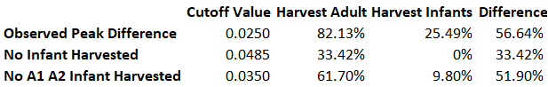

## Introduction

Abalones are distributed along the coastlines overwide and it is one of variable seafood. Overfishing is one of the factors putting abalones at the risk of extinction. It is very easy to over harvest because of the slow grow rates and unpredictable reproductive success of abalones. In order to manage abalone harvesting, we need to find a way to quickly study the age composition of abalones in different regions.

## Objects
- 1. We can use a microscope to determine abalone’s age by counting its growth rings. However, this is a slow process. Then a group of investors was trying to predict abalone age based on its physical measurements. They made a conclusion that age cannot be predicted based solely on the physical characteristics. This purpose of this report is to study why the investigators fail to predict age based on physical measurements by using exploratory data analysis. The report will review the abalone data to see whether we can predict age based on physical characteristics provided. In the process, we will also explore potential new predictable physical measurements.  The report will focus on investigating whether we can predict abalone age by physical characters with different sexes.


- 2. We will also incorporate CLASS and SEX in linear regression to predict physical measurement. Also, we will analysis and discuss different cutoff in harvesting abalones. 

## EDA-----------------------------------------------------------------------------


#### About the data

Important EDA methods to display aspects of these data such as: 

- 1) the center or location of distributions, 
- 2) the variation in different variables, 
- 3) the shape of various distributions, 
- 4) the presence of outliers 
- 5) differences in data characteristics between abalone classifications. 


```{r}
# Load the abalone data set
abalone <- read.csv("mydata.csv", sep="")
```


```{r}
str(abalone)
# Convert **RINGS** to factor because the value between does not have meaning
abalone$RINGS <- as.factor(abalone$RINGS)
```

About the abalone data (4141 observations and ten variables)

- 1) SEX = M (male), F (female), I (infant) 
- 2) LENGTH = Longest shell length in mm 
- 3) DIAM = Diameter perpendicular to length in mm 
- 4) HEIGHT = Height perpendicular to length and diameter in mm 
- 5) WHOLE = Whole weight of abalone in grams 
- 6) SHUCK = Shucked weight of meat in grams 
- 7) VISCERA = Viscera weight in grams 
- 8) SHELL = Shell weight after drying in grams 
- 9) RINGS = Age (+1.5 gives the age in years)  
- 10) CLASS = Age classification based on **RINGS**  (A1= youngest,., A6=oldest) 

```{r}
options(digits=4)
numericSummaryStats<-function(x){
  c(
    Min=min(as.numeric(x)),
    Q = quantile (as.numeric(x), 0.25),
    Median= median(as.numeric(x)),
    Mean= mean(as.numeric(x)),
    Q = quantile (as.numeric(x), 0.75),
    Max=max(as.numeric(x))
  )}

NumericSummary<- sapply(abalone[,2:8], numericSummaryStats)

library("knitr","xtable")
kable(NumericSummary,format="pandoc",caption="Numeric Variable Summary")

```

Above a simple summary for the variables measuring the length and weight of abalones from the 500 sample. The minimum value, first quartile, median, mean, upper quartile, and maximum value helps us understand the distribution of the variables. By comparing the mean and median, it looks like the shell weight maybe symmetrical distributed because the two values are very close. LENGTH and DIAM are negatively skewed because the median is larger the mean. 

In order to have a better idea of the relationships between the numeric variables, we have the scatterplots for the variables that summarized in Figure2. There are clear linear relationships between LENGTH, DIAM, and HEIGHT. LENGTH measures the longest length of the abalone shell. DIAM is the diameter perpendicular to LENGTH. HEIGHT is perpendicular to length and diameter. The width and the height of the shell will get larger as the shell length becomes larger.  The linear relationship between WHOLE and SHUCK is also strong. It makes sense as the whole weight included the shuck weight of the abalone.  It also looks like the positive relationship between SHUCK and VISCERA, VISCERA and SHELL are strong. However, the points are spread out.  In addition, from the right upper plots and the left lower plots, initially, as the lengths (LENGTH and DIAM) get longer, the weights, no matter how it measured, they are quite stable. When the LENGTH gets more than 0.4mm, the weights of the abalones increase very fast, and the rate of increases get faster. While the abalone reach a big weight, the lengths of the shell increase very little, it more like the shell won’t get bigger. In addition, it looks like there are some outliers come from the abalones with very high shell weight after dying.

```{r}
plot(abalone[,2:8])
```

```{r}
Sex_Class <- addmargins(table(abalone$SEX, abalone$CLASS))
kable(Sex_Class,format="pandoc",caption="Sex by Age Class")
```

Above groups female, infant and male abalones by shell classification. Because A1 indicates the youngest abalones and A6 represent the oldest. Apparently, infants should fall into the young groups.  But there some infants also belong to older groups, even A6.  In Figure4, we can also get that most female and male abalones fall in age A3. Overall, there are more male abalones than female abalones. 

As there are clear linear relationships between LENGTH, DIAM, and HEIGHT showing in above, we will create a new variable called VOLUME. VOLUME is calculated by multiplying LENGTH, DIAM and HEIGHT together. 

```{r}

VOLUME <- abalone$LENGTH * abalone$DIAM * abalone$HEIGHT
abalone <- data.frame(abalone, VOLUME)

library(ggplot2)
library(gridExtra)

ggplot(data=abalone, aes(x=WHOLE, y=VOLUME)) +
  geom_point(pch=16, color="black", size=2) +
  geom_smooth(method="lm",  se = FALSE, color="blue",  size=1.2, linetype=2) +
  labs(title="Plot WHOLE Versus VOLUME", x="Whole weight of abalone (grams)", y="VOLUME") +
  theme( 
    title = element_text(size = 13, color = "black", face = "bold"),
    axis.text = element_text(colour = "black", size = 12, face = "italic"),
    axis.text.y = element_text(colour = "black",size = 12),
    axis.title = element_text(size = 15, color = "black", face = "bold"),
    axis.title.y = element_text(size = 15, color = "black", face = "bold")
    
  )


```

Above is the plot between the whole weight of abalone and its volume.  The blue dash represents best fit for the black dots in the graph. Most of the black dots fall on or very close to the blue line when the whole weight within 0.5 grams and its less than 0.025 〖mm〗^3.  The dots get far away from the blue line as the weights gets larger. However, the VOLUMN has a positive linear relationship with the whole weight overall. Because VOLUMN is the product of LENGTH, DIAM, and HEIGHT. Those three values showing positive relationship with whole weight. However, the relationship looks weak when the abalone reach 0.5 grams and higher. 

```{r}
DENSITY <- abalone$WHOLE/abalone$VOLUME
abalone <- data.frame(abalone, DENSITY) 
#     Using DENSITY, present a matrix showing histograms, boxplots and Q-Q plots differentiated by sex.
#     The first row would show the histograms, 
#     The second row would show the boxplots  
#     The third row would show the Q-Q plots.      
par(mfrow = c(3,3))

hist((abalone[abalone[,1] == "F", 12]),main="Female Histogram",xlab = NULL, col = "red") 
hist((abalone[abalone[,1] == "I", 12]),main="Infant Histogram",xlab = NULL,col = "blue")
hist((abalone[abalone[,1] == "M", 12]),main="Male Histogram",xlab = NULL, col = "green")

boxplot((abalone[abalone[,1] == "F", 12]), main="Female Boxplot", ylab="DENSITY",col = "red")
boxplot((abalone[abalone[,1] == "I", 12]), main="Infant Boxplot", ylab="DENSITY",col = "blue")
boxplot((abalone[abalone[,1] == "M", 12]), main="Male Boxplot", ylab="DENSITY",col = "green")

qqnorm(abalone[abalone[,1] == "F", 12], ylab = "Sample Quantiles for Female",
       main = "Q-Q Plot for Female",
       col =  "red",cex.axis = 1.5, cex = 1.5)
qqline(abalone[abalone[,1] == "F", 12])
qqnorm(abalone[abalone[,1] == "I", 12], ylab = "Sample Quantiles for Infant",
       main = "Q-Q Plot for Infant",
       col = "blue",cex.axis = 1.5, cex = 1.5)
qqline(abalone[abalone[,1] == "I", 12])
qqnorm(abalone[abalone[,1] == "M", 12], ylab = "Sample Quantiles for Male",
       main = "Q-Q Plot for Male",
       col = "green", cex.axis = 1.5, cex = 1.5)
qqline(abalone[abalone[,1] == "M", 12]) 

```


Above is showing the density histograms, boxplots, and Q-Q plots by sex. We can look the histograms with Q-Q plots to investigate whether the density distributions are normally distributed.  On the right corners of the three Q-Q plots, we can see the dots above the black lines, which indicating that female, infant, and male DENSITY distributions right skinny tales. However, most of the dots fall on the black lines, which indicating female, infant and male density can treat normally distributed. The histograms also showing long right tails, which confirm we find from Q-Q plots.


On the second- boxplots, the circle dots showing on the boxplots indicating the outliers. All the sexes have extremely high densities. One female abalone has extremely low density as a circle dot at the bottom of the red boxplot. By comparing the maximum and minimum values from boxplots, we can see infant abalone density fall in a smaller range and interquartile range (IQR) comparing to female and male abalones. The interquartile range represented by the dots in the boxes, which takes up 50% of all the observations. However, when we refer to the density histogram x-axes, the infant has the biggest range as the right tail reaches to 45, comparing 35 for both female and male. That’s because the boxplot taking outliers into consideration.  

```{r}

library(moments)
options(digits=4)
Skew.Stats<-function(x){
    c(
      Skewness = skewness(as.numeric(x)),
      kurtosis = kurtosis(as.numeric(x))
        )}
      
library(plyr)
SEX.Skewness<- tapply(abalone$DENSITY, abalone$SEX, FUN=Skew.Stats)
      
      
      
options(digits=4)
Dis.Stats<-function(x){
        c(
          Min=min(as.numeric(x)),
          Q = quantile (as.numeric(x), 0.25),
          Median= median(as.numeric(x)),
          Q = quantile (as.numeric(x), 0.75),
          Max=max(as.numeric(x)),
          IQR = (quantile (as.numeric(x), 0.75)- quantile (as.numeric(x), 0.25)),
          Range = (max(as.numeric(x))- min(as.numeric(x)))
        )}

# library(plyr)
SEX.Density<- tapply(abalone$DENSITY, abalone$SEX, FUN=Dis.Stats)
SEX.Density

```

Above shows the IQR and Range with outliers included. We can see a higher IQR and Range for the DENSITY of infant abalones.


For far, it seems like that for the surprising high density (DENSITY >35) abalones, they are very likely are infants. However, the majority of the abalones from different sexes fall from the DENSITY 22 to 26. We cannot base on density to group abalone sex.

```{r}
# VOLUME boxplots differentiated by CLASS
ggplot(abalone, aes(x=CLASS, y=VOLUME)) +
  geom_boxplot(fill="cornflowerblue", color="black", notch= TRUE)+
  geom_point(position="jitter", color="blue", alpha=.5)+
  geom_rug(side="l", color="black") +
  labs(title= NULL, x="CLASS", y="VOLUME") +
  theme( 
    axis.text = element_text(colour = "black", size = 12, face = "italic"),
    axis.text.y = element_text(colour = "black",size = 12),
    axis.title = element_text(size = 15, color = "black", face = "bold"),
    axis.title.y = element_text(size = 15, color = "black", face = "bold"))

```


From WHOLE differenced by SEX boxplots, we can know that infant abalones have Signiant lower whole weight comparing to female and male abalones’.  

The WHOLE difference found among the sexes. Then we are trying to look whole with SEX and CLASS together


```{r}

# WHOLE boxplots differentiated by CLASS
ggplot(abalone, aes(x=CLASS, y=WHOLE)) +
  geom_boxplot(fill="cornflowerblue", color="black", notch= TRUE)+
  geom_point(position="jitter", color="blue", alpha=.5)+
  geom_rug(side="l", color="black") +
  labs(title= NULL, x="CLASS", y="VOLUME") +
  theme( 
    axis.text = element_text(colour = "black", size = 12, face = "italic"),
    axis.text.y = element_text(colour = "black",size = 12),
    axis.title = element_text(size = 15, color = "black", face = "bold"),
    axis.title.y = element_text(size = 15, color = "black", face = "bold"))

```

DENSITY differenced by SEX, we can know there are not much density difference among three sexes.

```{r}
# VOLUME boxplots differentiated by CLASS
ggplot(abalone, aes(x=SEX, y=VOLUME)) +
  geom_boxplot(fill="cornflowerblue", color="black", notch= TRUE)+
  geom_point(position="jitter", color="blue", alpha=.5)+
  geom_rug(side="l", color="black") +
  labs(title= NULL, x="CLASS", y="VOLUME") +
  theme( 
    axis.text = element_text(colour = "black", size = 12, face = "italic"),
    axis.text.y = element_text(colour = "black",size = 12),
    axis.title = element_text(size = 15, color = "black", face = "bold"),
    axis.title.y = element_text(size = 15, color = "black", face = "bold"))

```

```{r}
# WHOLE boxplots differentiated by CLASS
ggplot(abalone, aes(x=SEX, y=WHOLE)) +
  geom_boxplot(fill="cornflowerblue", color="black", notch= TRUE)+
  geom_point(position="jitter", color="blue", alpha=.5)+
  geom_rug(side="l", color="black") +
  labs(title= NULL, x="CLASS", y="VOLUME") +
  theme( 
    axis.text = element_text(colour = "black", size = 12, face = "italic"),
    axis.text.y = element_text(colour = "black",size = 12),
    axis.title = element_text(size = 15, color = "black", face = "bold"),
    axis.title.y = element_text(size = 15, color = "black", face = "bold"))

```


```{r}
#     Use aggregate() to compute mean values of WHOLE for each combination of SEX and CLASS.
#     Use the resulting object with ggplot to generate a plot of these mean values versus CLASS    
      
# Showing Mean WHOLE versus CLASS for Three Sexes
WHOLE.out <- aggregate(WHOLE~SEX+CLASS, data=abalone, mean) 

ggplot(data= WHOLE.out ,aes(x=CLASS, y=WHOLE, group=SEX, colour = SEX))+
  geom_line()+geom_point(size=4)+   
  ggtitle("Plot showing Mean WHOLE versus CLASS for Three Sexes")+
        theme( 
          title = element_text(size = 13, color = "black", face = "bold"),
          axis.text = element_text(colour = "black", size = 12),
          axis.text.y = element_text(colour = "black",size = 12),
          axis.title = element_text(size = 15, color = "black", face = "bold"),
          axis.title.y = element_text(size = 15, color = "black", face = "bold")
             )
      
      # Showing Mean DENSITY versus CLASS for Three Sexes
      DENSITY.out <- aggregate(DENSITY~SEX+CLASS, data=abalone, mean) 
      
      
ggplot(data= DENSITY.out ,aes(x=CLASS, y=DENSITY, group=SEX, colour = SEX))+
  geom_line()+geom_point(size=4)+   
  ggtitle("Plot showing Mean DENSITY versus CLASS for Three Sexes")+
        theme( 
          title = element_text(size = 13, color = "black", face = "bold"),
          axis.text = element_text(colour = "black", size = 12),
          axis.text.y = element_text(colour = "black",size = 12),
          axis.title = element_text(size = 15, color = "black", face = "bold"),
          axis.title.y = element_text(size = 15, color = "black", face = "bold")
              )
  
```

We will also take a same approach for DENSITY. Above shows mean DENSITY versus CLASS for three sexes. The infant abalones have extremely high average density at young age, and extremely low average density at old ages. However, female and male abalones have more stable average DENSITY. From A2 to A6, Male abalones have higher mean DESENTY than female abalones. Especially at A3 and after, both female and male abalones have much higher average DENSITY than infant abalones. There are good possibilities to predict old abalones by DENSITY. 


### Conclusion

In summary, it is hard to predict the abalone age by the physical measurements. However, taking SEX in to consideration, we can somehow predict age class by WHOLE and DENSITY.  It looks like we can predict young abalones by average whole weight. In addition, there are good possibilities to predict old abalones by DENSITY. When the DENSITY is extremely high or extremely low, they are very likely are infants. By measuring the whole weight of abalones, we know potentially predict infants by the low WHOLE. To be more specifically, when DENSITY is above 25, and WHOLE below 0.375, the abalone very likely are infants with class A1 or A2. When DENSITY below 23.5, and WHOLE Below 0.75, there are also good chances are infants. 

When we use samples to study the populations, we have to investigate whether the samples are representative for the populations. First, we have to make sure the sample size is large enough. We can apply central limit theorem to estimate the sample size. Then, we should know how the sample is sampled. Depending on the study purpose and the characters of the population, random, systematic, stratified sampling or other sampling can be used to ensure the samples are representative.  Third, we have to consider the sample errors. The samples cannot perfectly represent the populations. In order to truthfully estimate population parameters based on the samples, we should take interval estimate into consideration. This give other ideas the researchers confidence of the estimates and results. 
From the abalone data, the problems for observation data are potential bias. We can use many ways to describe a group. The measurements used in the study might not enough. The season, location of the coastline, and other factors can affect the abalone ages.  I think in different seasons, the physical measurement or even sex might be very different. In addition, there are different kind of abalones. We may have problems to apply what we learned in one kind to other kinds. 


## Model Building--------------------------------------------------------------------

In our earlier exploratory data analysis, we find out that physical measurements might useful when predicting age in younger abalones. In addition, we observed a notable difference between SEX in physical measurement. We will measure the difference in physical measurements in CLASS and SEX. Analysis of variance will be performed in this report. We will also incorporate CLASS and SEX in linear regression to predict physical measurement. Also, we will analysis and discuss different cutoff in harvesting abalones. 


From the sample we taken from the abalone data. We want to test the independence of two variables SHUCK and VOLUME.  We can use chi-square test of independence to test whether SHUCK and VOLUME are independent. The null hypothesis is SHUCK and VOLUME are not related. We transform SHUCK and VOLUME into categorical variables by evaluating each observed value with its medians:

```{r}
# Write a function in R to calculate the Pearson chi square statistic on 2x2 contingency tables   
# Refer to Black chapter 16.2

Defined_chi <- function(x) {
  # Expected values are calculated
  e11 <- x[3,1]*x[1,3]/x[3,3]
  e12 <- x[3,2]*x[1,3]/x[3,3]
  e21 <- x[3,1]*x[2,3]/x[3,3]
  e22 <- x[3,2]*x[2,3]/x[3,3]
  
  # Our next step is to use our observed (values in our actual table)
  # and expected values to calculate chi-square.
  
  chisq <- (x[1,1]-e11)^2/e11 + (x[1,2]-e12)^2/e12 + (x[2,1]-e21)^2/e21 + (x[2,2]-e22)^2/e22  
  return(chisq)
} # end of function

```


```{r}

# To be used with 2x2 contingency tables that have margins added.  
shuck <- factor(abalone$SHUCK > median(abalone$SHUCK), labels = c("below", "above"))     # will return FLASE & TRUE, FALSE->"Below"
volume <- factor(abalone$VOLUME > median(abalone$VOLUME), labels = c("below", "above"))
shuck_volume <- addmargins(table(shuck,volume)) 

Defined_chi(shuck_volume)
pchisq(Defined_chi(shuck_volume),1,lower.tail = FALSE)

# critical chi-square with significant level 0.01:
qchisq(0.01, 1, lower.tail = FALSE)

```

We can see many abalones have both SHUCK and VOULME below or above the medians. This suggest SHUCK and VOLUME are related. If an abalone has SHUCK above (below) median, it is very likely the VOLUME is also above (below) median. To confirm the assumption, we calculate the Pearson Chi Square statistic SHUCK and VOLUME summarized in Figure1. The Chi Square value we get is 323.21 with a p-value 2.890771e-72. The p-value is very small, which almost close to zero. This means when the hypotheses for SHUCK and VOLUME is independent, the probability of obtaining the result is almost 0. To have a better idea, let’s say we define the significance level 1%. We will get the critical Chi Square 6.63. We will reject the null hypothesis if the calculated value is more than 6.63. The Chi Square value we calculated 323.21 is far away from 6.63. Then we have to reject the null hypotheses SHUCK and VOLUME are independent. We adopt the alternative hypothesis SHUCK and VOLUME are dependent.

```{r}

plot(abalone$SHUCK,abalone$VOLUME, xlab=" SHUCK",  pch=16, ylab= "VOLUME", main= "SHUCK and VOLUME Scatterplot")
abline(lm(abalone$VOLUME~abalone$SHUCK), col="red", lty = 1, lwd=2) # regression line (y~x) 

```


```{r}

cor(abalone$SHUCK,abalone$VOLUME)
```

The scatterplot for SHUCK and VOLUME. We can see that they have a positive relationship. From what we observed in Figure 1, having a SHUCK or VOLUME above (or below) its median means an individual is much more likely to have the other measure also above (or below). The correlation between SHUCK and VOLUME is 0.94, which is very close to 1. SHUCK and VOLUME have a very strong positive relationship.

```{r}
RATIO <- abalone$SHUCK/abalone$VOLUME
abalone <- data.frame(abalone, RATIO)

library(ggplot2)
ggplot(abalone, aes(x=CLASS, y=RATIO)) +
  geom_boxplot(fill="cornflowerblue", color="black", notch= TRUE)+
  geom_point(position="jitter", color="blue", alpha=.5)+
  labs(title= " Boxplots of RATIO differentiated by CLASS", x="CLASS", y="RATIO") +
  theme( 
    title = element_text(size = 13, color = "black", face = "bold"),
    axis.text = element_text(colour = "black", size = 12, face = "italic"),
    axis.text.y = element_text(colour = "black",size = 12),
    axis.title = element_text(size = 15, color = "black", face = "bold"),
    axis.title.y = element_text(size = 15, color = "black", face = "bold")
  )
```
Since SHUCK and VOLUM has a positive relationship. We create a new variable RATIO equal to SHUCK divided by VOLUME. The boxplots of RATIO differentiated by CLASS. It reveals that as the abalones get mores RINGS, the RATIO decrease. Since CLASS is grouped by the number of RINGS. A1 is the youngest; and A6 is the oldest. The RATIO reflect the density of abalones. We can interpret that abalones’ density decrease as they getting older. It seems CLASS can be a good predictor for RATIO. A1, A2, and A3 appear to have higher RATIO than A4, A5, and A6.


```{r}
# Perform an analysis of variance using aov() on RATIO using CLASS and SEX

aov1 <- aov(RATIO~CLASS+SEX+CLASS*SEX, abalone)
summary(aov1)
```

We performed an analysis of RATIO variance using CLASS, SEX, and the interaction effect of CLASS and SEX.  This two-way variance analysis allowing us to see how the RATION variance look like for different CLASS from SEX. The analysis of variance real that CLASS is the dominant variance source because the P-value is very small.  SEX and the interaction effect are not statically significant from the large p-values.

```{r}
ggplot(abalone, aes(x=SEX, y=RATIO)) +
  geom_boxplot(fill="cornflowerblue", color="black", notch= TRUE)+
  geom_point(position="jitter", color="blue", alpha=.5)+
  labs(title= " Boxplots of RATIO differentiated by SEX", x="SEX", y="RATIO") +
  theme( 
    title = element_text(size = 13, color = "black", face = "bold"),
    axis.text = element_text(colour = "black", size = 12, face = "italic"),
    axis.text.y = element_text(colour = "black",size = 12),
    axis.title = element_text(size = 15, color = "black", face = "bold"),
    axis.title.y = element_text(size = 15, color = "black", face = "bold")
  )
```

The boxplots of Ratio differentiated by SEX. The infants have slightly higher RATIO comparing to both adult female and male abalones.  Female and male abalones have no difference in RATIO. When we do a one-way analysis of RATIO by SEX. We get a p-value of 0.0362, which is statically significant with 5% significance level. This means at least two groups of SEX’s RATIO means are significantly different from each other.  

we know that the main variance is contributed by the difference between infants and female abalones. Male and female abalones have a very large p-value. Combining what we observed from " boxplots of Ratio differentiated by SEX" , male and female abalones can be grouped into a single category as “adults”. 

```{r}
aov.sex<- aov(RATIO~SEX, abalone)
summary(aov.sex)  
TukeyHSD(aov.sex)
```

Since the interaction effect of CLASS and SEX is not statically significant in RATIO. We perform another two-way analysis for RATIO with CLASS and SEX. 

The analysis of variance for CLASS and SEX.  A4-A1, A5-A1, A6-A1, A4-A2, A5-A2, A6-A2, AND A6-A3 have small adjusted p-values. This result reflects that A1 has statically significant RATION mean comparing to A4, A5, and A6. A2 also has statically significant RATION mean comparing to A4, A5, and A6.  A1-A2 hypothesis has a very high p-values. The difference between A1 and A2 is not significant, as the p-value is 0.855. In summary, A1 and A2 have similar RATIO distribution. A4, A5, and A6  can be in another group. But have to notice that the difference between A3 and A6 is statistically significant. 
```{r}
aov2 <- aov(RATIO~CLASS+SEX, abalone)
summary(aov2)

r <- residuals(aov2)
fitt <- fitted(aov2)
```

```{r}
par(mfrow = c(1,2))
hist(r, col = "red", main = "Histogram of Residuals", xlab = "Residual")
boxplot(r, col = "red", main = "Boxplot Residuals", ylab = "Residual")
par(mfrow = c(1,1))

qqnorm(r, col = "red", pch = 16, main = "QQ Plot of Residuals")
qqline(r, col = "green", lty = 2, lwd = 2)

```
```{r}
require(moments)
skewness(r)
kurtosis(r)
```

```{r}
# 95% residule value
qnorm(0.025, mean = 0, sd = sd(r), lower.tail = TRUE)
```

```{r}
plot(fitt,r, main = "Plot of residuals versus fitted values", xlab = "fitted values",
     ylab = "residuals", col = "red")
abline(h = 0, lty = 2, col = "green")
abline(h = 3.95, lty = 2, col = "blue")
abline(h = -3.95, lty = 2, col = "blue")

```


```{r}
TukeyHSD(aov2)
```

```{r}
# scatterplot of SHUCK versus VOLUME  

ggplot(data=abalone, aes(x=VOLUME, y=SHUCK, color=CLASS)) +
  geom_point(pch=16, size=2) +
  geom_smooth(method="lm",  se = FALSE, color="black",  size=1.2, linetype=1) +
  labs(title="Scatterplot of SHUCK versus VOLUME", x="VOLUME", y="SHUCK") +
  theme( 
    title = element_text(size = 13, color = "black", face = "bold"),
    axis.text = element_text(colour = "black", size = 12),
    axis.text.y = element_text(colour = "black",size = 12),
    axis.title = element_text(size = 15, color = "black", face = "bold"),
    axis.title.y = element_text(size = 15, color = "black", face = "bold")
  )

```


```{r}
# Logarithms form
ggplot(data=abalone, aes(x=log(VOLUME), y=log(SHUCK), color=CLASS)) +
  geom_point(pch=16, size=2) +
  geom_smooth(method="lm",  se = FALSE, color="black",  size=1.2, linetype=1) +
  labs(title="Scatterplot of L_SHUCK versus L_VOLUME", x="L_VOLUME", y="L_SHUCK") +
  theme( 
    title = element_text(size = 13, color = "black", face = "bold"),
    axis.text = element_text(colour = "black", size = 12),
    axis.text.y = element_text(colour = "black",size = 12),
    axis.title = element_text(size = 15, color = "black", face = "bold"),
    axis.title.y = element_text(size = 15, color = "black", face = "bold")
    
  )

```

In our previous analysis of variance, we find out that the RATION means are very different within CLASS. Since RATIO is SHUCK divided by VOLUME, we want to know how abalones CLASS look like with different combinations of SHUCK and VOLUME. Figure 9 and Figure 10 are the scatterplots of SHUCK versus VOLUME. Figure 10 has scaled SHUCK and VOLUME in to logarithms. The color of the points represents different CLASS. From both scatterplots, we can observe A1 and A2 have lower VOLUME and smaller SHUCK, which fall in the left lower parts of the graphics.  From Figure 8, A1 and A2 are very close to the regression lines. A3 to A6 are more apart from the regression line. With the logarithm form (Figure 9), it is more clear that A1 and A2 have much lower VOLUMN and SHUCK comparing to other CLASS. We can see some A3 and A4 class from Figure 8. But after scaling them, there are only A1 and A2 falling in the left lower corner. The other CLASS are on the top right. The logarithm scaling making CLASS more distinctive. It is apparent that A1 and A2 are very different to other CLASS. With the logarithm, it appears the difference between A1 and A2 is much clear comparing to Figure 9.   It is clear to us that we can harvest abalones based on VOLUME and SHUCK. In addition, we can see the points are closer to the regression with logarithm, which means a smaller variance. 


From the analysis, we already know VOLUME has a positive relationship with SHUCK. Since the variance is smaller with logarithm scaling for VOLUME and SHUCK.  Also, it is also better to distinguish with the CLASS with this transformation. We will still use the logarithm for prediction to increase the accuracy. For CLASS, young abalones tend to have lower SHUCK. The SHUCK tend to get larger as for older CLASS. We made the assumptions that CLASS is a predictive variable for harvesting abalones. We will use it in the regression model. At this moment, we try to add SEX into the model to see whether it is predictive. Figure 11 is the summary of the regression model.  The summary confirms what we have found earlier.  VOLUME and CLASS are predictive for SHUCK. SEX is not predictive because the large p-values. For the CLASS in the regression summary, each CLASS comparing to A1. As we found in Figure 8 is the analysis of RATIO variance for CLASS and SEX.  A1 is very different to A3, A4, and A5. In earlier analysis, A1 and A2 is very similar. But after transforming SHUCK and VOLUME into logarithm form. The log SHUCK mean of A1 and A2 is closer. The p-value is 0.06898, much smaller than the p-value 0.855 in Figure 8. The coefficient estimates for CLASS A3, A4, and A5 are very good. Maybe the similarity between A1 and A2. The coefficient for A2 is not very good.

```{r}
lm.model <- lm(log(SHUCK)~log(VOLUME)+CLASS+SEX, abalone)
summary(lm.model)
```


Since SEX is not a good predictor for L_SHUCK in the regression model. We take out SEX from the model, and rebuild the regression model based on L_VOLUME and CLASS. Above is the summary for the updated regression model. The residual standard error and R squared are very close to both models. It means adding SEX to the model didn’t help the model. SEX is not predictive. 

```{r}
out <- lm(log(SHUCK)~log(VOLUME)+CLASS, abalone)
summary(out)
```

To examine the fit of the regression model, we have to check whether the residuals of the model is approximate to a normal distribution. The histogram and the boxplot of the regression model residuals. The residual histogram seems a little right skewed since there is a fatter tail on the right. There are some outliers one both sides of the boxplots, showing some predictive values are far away from the actual values. Some are way much larger or smaller than the actual values. 

The QQ plot of residuals in Figure 14 showing some points on the right up corner of the line, which confirmed that the residual histogram is right skewed. We also calculated the skewness is 0.0264, and the kurtosis is 3.739. For a normal distribution, the skewness should be 0 with s kurtosis of 3. The histogram, the QQ plot, and the calculations showing up the residual of the regression model is a little of right skewed. 

```{r}
par(mfrow = c(1,2))
hist(out$residuals, col = "red",breaks = "fd",  main = "Histogram of Residuals", xlab = "Residual")
boxplot(out$residuals, col = "red", main = "Boxplot Residuals", ylab = "Residual")
par(mfrow = c(1,1))

qqnorm(out$residuals, col = "red", pch = 16, main = "QQ Plot of Residuals")
qqline(out$residuals, col = "black", lty = 2, lwd = 2)

```

```{r}
require(moments)
skewness(out$residuals)
kurtosis(out$residuals)
```

```{r}
resid.quant <- quantile(out$residuals, probs = c(0.025, 0.975))
resid.quant  
```

```{r}
plot(fitted(out),out$residuals, main = "Plot of residuals versus fitted values", xlab = "fitted values",
     ylab = "residuals", col = "red")
abline(h = 0, lty = 2, col = "green")
abline(h = 0.399, lty = 2, col = "blue")
abline(h = -0.350, lty = 2, col = "blue")
```

The plot of residuals versus fitted values. The green dash line showing the residuals with a mean of zero. The point between the two blue dash lines represent 95% of the residuals. The points are randomly falling in the graph, means the model is a good fit. VOLUME and CLASS are good variables for predicting SHUCK. Even some outliers showing there, we need other information to improve the model. 

```{r}

# Using ggplot2 to plot above plots
# Residula histogram

ggplot(out, aes(x = out$residuals)) + geom_histogram()

# Residule QQ Plot
resid.quant <- quantile(out$residuals, probs = c(0.25, 0.75))
theor.quant <- qnorm(c(0.25, 0.75))

slope <- diff(resid.quant)/diff(theor.quant)
intercept <- resid.quant[1] - slope * theor.quant[1]
ggplot(out, aes(sample = out$residuals)) + stat_qq() +
  geom_abline(intercept = intercept, slope = slope)

```

```{r}
#  Plot the residuals versus L_VOLUME coloring the data points by CLASS
ggplot(out, aes(x = log(abalone$VOLUME),y = out$residuals)) + geom_point(aes(color = CLASS)) +
  labs(x = "L_VOLUME", y = "Residual")   

```

To look the residuals in more detail, we make a plot of the residuals versus L_VOLUME coloring by CLASS, which is showing in above. In this way, we can examine the L_VOLUME and CLASS at the same time to see whether we can find some patterns. By looking the different values of the L_VOLUME, the points are randomly falling. There are no unusual residuals for certain L_VOLUME. However, when we look the CLASS. The extremely high and low residuals are from A2. Looking L_VOLUME and CLASS together. L_VOLUME can differentiate CLASS A1 and other classes very well.  To examine the residuals more carefully, we make boxplots of residuals differentiated by CLASS. 

The distributions of different class are very similar. It appears there are not much difference. We can observe the extremely high and low residuals for A2, which are the outliers showing in the boxplots. Except for A6, all the CLASS have residual outliers. Overall, the regression model is a good fit.

```{r}
# ggplot to present boxplots of the residuals differentiated by CLASS
ggplot(out, aes(x=abalone$CLASS, y=out$residuals)) +
  geom_boxplot(fill="cornflowerblue", color="black", notch= TRUE)+
  geom_point(position="jitter", color="blue", alpha=.5)+
  labs(title= " Boxplots of residuals differentiated by CLASS", x="CLASS", y="residuals") +
  theme( 
    title = element_text(size = 13, color = "black", face = "bold"),
    axis.text = element_text(colour = "black", size = 12, face = "italic"),
    axis.text.y = element_text(colour = "black",size = 12),
    axis.title = element_text(size = 15, color = "black", face = "bold"),
    axis.title.y = element_text(size = 15, color = "black", face = "bold")
  )
```
So far, we know that infant abalones have smaller VOLUME comparing to adult abalones. For the harvesting purpose, we can use VOLUME to manage abalone harvest. There is tradeoff for harvesting. We will not harvest abalones if they fall below a cutoff VOLUME defined. If we make the cutoff VOLUME very large, it will help us to protect the infants since they present future harvests. However, we may harvest very few abalones and it won’t be efficient. Since we want to maximize the proportion of adult abalones and minimize the proportion of infants to be harvested. We can try to get a cutoff that maximize the difference harvesting adults and infants. 


We know that as the VOLUME getting large, the proportion of abalones are harvested are getting larger. We can think in this way, when the cut off for VOLUME is 0, the proportion of abalones not harvested will also be 0. Because VOLUME is always larger than 0. When the cut off is large enough, all the abalones will not be harvested.  Below showing the accumulated proportion of infants not harvested as the cut off for VOLUME getting larger. The vertical line represents 50% of the abalones not harvested. The vertical line the correspondent VOLUME value for the 50% split. The 50% split VOLUME value is 0.0164 〖mm〗^3. It looks like the proportion of infants not harvested increasing steadily until 0.024, then increasing slower and slower. After it approach approximate 0.045, the proportion of infants not harvested almost close to 100%. 


We also want to know the relationship between VOLUME cut off and the proportion of adults not harvest. Figure 19 is the graphic showing the relationship for adult abalones. The vertical line represents 50% of the abalones not harvested. The vertical line the correspondent VOLUME value for the 50% split. The 50% split VOLUME value is 0.0396 〖mm〗^3. From 0 to 0. 0164, which is the 50% split for infants, the proportion of adults not harvest increasing very slowly. Until it reaches 0.02, the proportion increasing steadily. Which makes sense, because we know infant abalones have significant smaller VOLUME than adults. There are very few adult abalones have very small VOLUME as infants. In addition, for infants, the VOLUME gets larger as they mature. When they become adults, the rate of VOLUME becomes slower. This is why Figure 18 have a bigger rise in the beginning comparing to Figure 19.

From the separate graphic Figure 18 and Figure 19, it is very hard to determine which cut off we should choose. Figure 20 presents the difference in harvest percentage of adults and infants with volume values. The peak value is observed at VOLUME 0.02498 〖mm〗^3  with a maximum percentage difference of 0.56642 .  At the peak value, there are 25.49% infants are harvested. 82.13% for adult abalones. If we want to measure by using the difference in harvesting in infants and adults, the peak value should be picked. In reality, the cost of harvest an infant and the cost of missing harvesting an adult abalone might be considered. Then other cutoffs should be considered when the different cost of errors are weighted in the measurement. 

```{r}

idxi <- abalone[,1]=="I"   # to evluate the "SEX" column, return "TRUE" /"FALSE" statement
idxf <- abalone[,1]=="F" 
idxm <- abalone[,1]=="M" 

max.v <- max(abalone$VOLUME)   # Maximum VOLUME
min.v <- min(abalone$VOLUME)   # Minimum VOLUME
delta <- (max.v - min.v)/100  # Divided VOLUME in to 100 

prop.infants <- numeric(0)    # Numeric(0) does not mean 0, it means a numeric vector of length zero (i.e., empty). 
volume.value <- numeric(0) 
total <- length(abalone[idxi,1])  # This value must be changed for adults. Total "Infant" observations
                                 # nrow(subset(abalone, abalone$abalone=="I"))

for (k in 1:100) {    # We divided VOLUME into 100 parts in the begining 
  value <- min.v + k*delta   
  volume.value[k] <- value   
  prop.infants[k] <- sum(abalone$VOLUME[idxi] <= value)/total # we have defined "total" as total number of infants
    } 

# prop.infants shows the impact of increasing the volume cutoff for harvesting.    
# The following code shows how to "split" the population at a 50% harvest of infants.

n.infants <- sum(prop.infants <= 0.5) 
split.infants <- min.v + (n.infants + 0.5)*delta  # This estimates the desired volume. 
                                                  # Same as quantile(mydata$VOLUME[idxi], probs=0.5)
                                                  # What's the VOLUMN for 50% blow

plot(volume.value, prop.infants, col = "green", main = "Proportion of Infants Not Harvested",
     type = "l", lwd = 2) 

abline(h=0.5) 
abline(v = split.infants) 
```
```{r}
# b)  Modify the code.  This time instead of counting infants, count adults
#     Present a plot showing the adult proportions versus volume.

adults <- abalone[,1]!="I"   # to evluate the "SEX" column, return "TRUE" /"FALSE" statement


max.v <- max(abalone$VOLUME)   # Maximum VOLUME
min.v <- min(abalone$VOLUME)   # Minimum VOLUME
delta <- (max.v - min.v)/100  # Divided VOLUME in to 100 

prop.adults <- numeric(0)    # Numeric(0) does not mean 0, it means a numeric vector of length zero (i.e., empty). 
volume.value <- numeric(0) 
total.adults <- length(abalone[adults,1])  # Total "adults" observations


for (k in 1:100) {    # We divided VOLUME into 100 parts in the begining 
  value <- min.v + k*delta   
  volume.value[k] <- value   
  prop.adults[k] <- sum(abalone$VOLUME[adults] <= value)/total.adults
} 


n.adults <- sum(prop.adults <= 0.5) 
split.adults <- min.v + (n.adults + 0.5)*delta  # This estimates the desired volume. 


plot(volume.value, prop.adults, col = "green", main = "Proportion of Adults Not Harvested",
     type = "l", lwd = 2) 

abline(h=0.5) 
abline(v = split.adults) 

```


```{r}
#  "difference" is the difference in adult and infant proportions harvested

difference <- (1-prop.adults)-(1-prop.infants)

plot(volume.value, difference, col = "green", main = " Harvested Difference Versus volume.value",
     type = "l", lwd = 2) 
abline(v = volume.value[which.max(difference)], lty = 2, col = "dodgerblue4")

  text(volume.value[which.max(difference)] + 0.003, 0.4,
     paste("volume =",
           round(volume.value[which.max(difference)], 5)), srt = 90)

abline(h=max(difference),lty = 2, col = "dodgerblue4") 

```

```{r}
# Determine the volume.value which corresponds to the observed "peak" difference
max(difference)
Peak.volume.value<- volume.value[which.max(difference)]
Peak.volume.value
```

```{r}
# What harvest proportions for infants and adults 
# would result if this volume.value is used as a "cutoff" for decision making?  
# Should other cutoffs be considered?

harvest.infants <- 1- sum(abalone$VOLUME[idxi] <= Peak.volume.value)/total
Peak.volume.value

harvest.adults <- 1- sum(abalone$VOLUME[adults] <= Peak.volume.value)/total.adults
harvest.adults
```

```{r}
# we simply need to plot the TPR, (1-prop.adults), as a function of the FPR
# we already have our true and false positive rates; TPR and FPR. (1-prop.adults) is our true positive rate
 plot( 1-prop.infants, 1-prop.adults, col = "green", main = " ROC Curve",
       type = "l", lwd = 2) 
 abline(a=0, b=1, col = "darkred", lty = 2, lwd = 2)

```


For harvesting, if an infant is harvested, then this is a false positive as the infant is being treated as an adult.  The true positive cases are the adults get harvested. The ROC curve in Figure 21 illustrates the tradeoffs involved with volume value cutoff decision rules.  True positive rate is the one minutes the proportion of adults fall below the cutoff value. The false positive is one minutes the proportion of infants not harvested. With different potential harvest volume value cutoffs being picked, it will end up with different proportions of adults and infants harvested.  From Figure 21, with a false positive rate 0, there will be no infants being harvested. However, the true positive rate will be very small. For the false positive to be 0, which will be observed at the maximum infant VOLUME. At this maximum infant VOLUME, all the infants less than the cutoff, then they won’t be harvested. The smallest cutoff for which no infant is harvested is 0.0485 〖mm〗^3. The corresponding value for the percentage of adults being harvested is 33.42%. This is almost one third of the adults being harvested. It is not a reasonable choice. In Figure 20, where we show the peak value. There are there 25.49% infants and 82.13% adults are harvested. The difference is 56.64%.  With zero infants harvested, the difference is 33.42%, which is much smaller than 56.64%. We can harvest 48.71% more adults at peak values with the cost of 25.49% infants being harvested. If the cost of harvesting infants and miss harvesting adults are similar, to target zero false positive is not a reasonable choice. 

In Figure 18 observed that when the VOLUME reaches approximate to 0.036, the percentage of infants adding to not harvested is very small. In our data set, SEX and CLASS are closely related to abalone age. Not only from the SEX perspective, we also want to make sure A1 and A2 minimized in harvesting.  With a cutoff 0.036. We find out there are zero percent of infant A1 and infant A2 will be harvested. The calculated correspond maximum VOLUME for A1 and A2 are 0.0204 and 0. 0347. The 0.036 cut off is larger than the maximum infant VOLUME for both A1 and A2.
We also want to pick up a smaller cutoff to see what the percentage of A1 and A2 will be harvested.  Figure 22 is a table showing the harvest proportions of infants and adults per CLASS for the following cutoffs: 0.036, 0.035, 0.034.  The minimum cutoff producing zero infant harvest in A1 and A2 is 0.035. From Because from Figure 22, the cutoff 0.034 with infants A2 has a harvest rete more than zero. For adult abalones, all these three cutoff will end up harvest zero percent for A1. However, cutoff from 0.034 and 0.036 will harvest some A2 adult abalones.


```{r}
#  smallest cutoff (i.e. volume.value) for which no infant is harvested 
 
smallest.cutoff <- volume.value[prop.infants==1]  # which is the smallest VOLUMN of infants
smallest.cutoff

```
```{r}
# Report this cutoff and the corresponding (1-prop.adults) value
1- sum(abalone$VOLUME[adults] <= smallest.cutoff)/total.adults
 
```


```{r}
# find the largest A1 infant volume and rounds up to the desired precision.
#  the "+ 0.0003" is just to make sure round() rounds up to the thousandths place 
 round(
   max(abalone[abalone$CLASS == "A1" &
                abalone$SEX == "I", "VOLUME"]) + 0.0003, 3)
 
```




We have discussed three cutoffs so far. Figure 23 is the summary. From the perspective of difference in harvest percentage of adults and infants, the observed peak value is most desirable.  We have discussed earlier that it is not a reasonable decision to make the cutoff large enough to insure zero percent of infants being harvested. We know there are some infant outliers which also affect the results. Also, with only 33.42% adults getting harvest, it is not efficient. When Taking CLASS into consideration, with only infants belong to A1 and A2 not harvested. The difference is 51.90% with 61.70% adults get harvested. This potentially can be a good cutoff. It is really a matter what we criteria we want to use to measure the performance. If we only care the difference, then we should choose the observed peak difference VOLUME value, which is 0.025. However, if harvesting A1 and A2 having a much cost comparing missing harvest adults. We might consider the VOLUME value with no A1 and A2 infants harvested. In reality, the adult can gain VOLUME when they getting older, even we do not harvest them now, we might harvest it in the future when the excess the cut off value. It will eventually get harvested. The false positive has more cost comparing to false negative. Without this kind of information, it is hard to choose cutoff between 0.025 and 0.035. Maybe another value between this is more desirable with other information considered.


### Conclusions

By performing analysis of variance and linear regression, we have confirmed our finding in our earlier exploratory data analysis that physical measurements are useful when predicting age in CLASS and SEX. A1 and A2 are similar in physical measurements. A4, A5, and A6 are close in central tendency for physical measurements. Male and female abalones can be grouped into a single category as “adults”. The infant abalones’ physical measurements are statically significant from adult abalones. 

VOLUME and CLASS are predictive for SHUCK. SEX is not predictive in regression model we built. The regression model is a good fit. We need other information to improve the model because the model residuals distribution is a little right skewed and we also find some outliers.
We can use VOLUME to manage abalone harvest. There is tradeoff for harvesting. We will not harvest abalones if they fall below a cutoff VOLUME defined. If we make the cutoff VOLUME very large, it will help us to protect the infants since they present future harvests. However, we may harvest very few abalones and it won’t be efficient. We have examined to case to make the cutoff which maximize the in harvest percentage of adults and infants at the peak value. This is desirable. We also calculated the cutoff the let the infants harvest percentage to be zero. However, there are a small percentage of adults get harvested, which is not efficient even we have protected all the infants. In addition, we also considered to only protecting all the infants belong to A1 and A2. In this case, there are 61.70% adults harvested. This also looks desirable. 

We do not know the cost of false positive and false negative. We assumed the cost of harvesting infants are much higher than adults. Because adults can be harvested later while they get larger and heavier. We need analysis of the costs and taking other factors into consideration when choose the best cutoff. 

There are some other important variables maybe we did not look at because the limitations. Also, we did not collect those data. We didn’t know how they sample the data. With a larger sample size, it will be more preventive for the abalone population and also increase the accuracy in linear regression model and choose the cutoff point. We didn’t split the data we studied. What we find out there might not work for the data we have never seen before. Testing should be performed. We should also conduct the confidence intervals for the regression model and the cutoff points we choose. 

